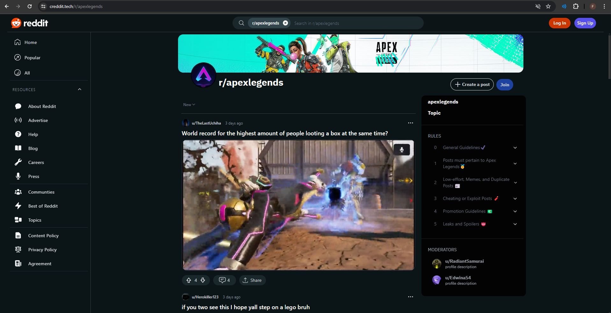

# cReddit : reddit clone  

 </img>

# Introduction 
cReddit is a Reddit clone that allows users to create posts, comment on posts, upvote and downvote posts and comments, and search for posts. The app is built using React,NodeJs .
# Full demo video 
https://github.com/mtheggi/cReddit-Frontend/assets/88272272/63c34eb0-624f-455a-88aa-70809cabee25

# Project Links

- [**Website**](https://creddit.tech/)
- [**Mobile App**](https://github.com/SS-Ltd/cReddit-CrossPlatform/releases/tag/V3.0.1)

## Frontend Team 🎨
- Ahmed Abdelaal
- Bassel Mohamed
- Malek Elsaka (team Leader)
- Marwan Abbas
- Mohamed Heggi

## lesson learned
- agile methodology 
- how to work with a team
- state management using context API 
- axios interceptors 
- making responsive desgin 
- using tailwind css
- data pagination ,
- ... more 

